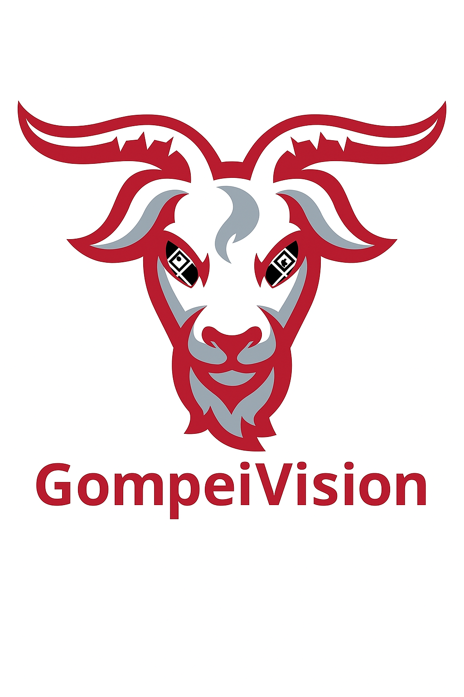

# GompeiVision

GompeiVision is the in-house, custom vision solution developed by FRC Team 190, Gompei and the H.E.R.D.

## Inspiration

The development of GompeiVision was heavily inspired by the fantastic work done by FRC Team 6328, Mechanical Advantage, on their vision system, **[Northstar](https://github.com/Mechanical-Advantage/RobotCode2025Public/tree/main/northstar)**. We are grateful for the ideas and inspiration they have shared with the FRC community.

## A Note to Other FRC Teams

While we are proud to share our code with the community, Please keep the following in mind:

*   **Highly Customized:** GompeiVision is built for our specific robots, sensors, and programming framework. It is not a general-purpose solution and would likely require significant modification to work on other robots.
*   **Unsupported:** Our team's focus during the build and competition season is on our own robot. Therefore, we **cannot guarentee any support, answer questions, or accept feature requests** for this project.

You are absolutely welcome to fork this repository and adapt it for your own needs. However, please be aware that you will be responsible for implementing, debugging, and maintaining your version.

## Recommended Alternatives

For teams looking for a robust, well-supported, and community-tested vision solution, we highly recommend the following excellent options:

*   **[Limelight](https://limelightvision.io/)**: A plug-and-play vision solution that is very popular in FRC.
*   **[PhotonVision](https://photonvision.org/)**: A powerful, open-source vision software that runs on a variety of hardware.

These projects have dedicated communities and support channels to help you succeed.

## Philosophy, Goals, and Requirements
Yet again, inspired by FRC 6328's [computer vision conference](https://www.youtube.com/watch?v=fwEUqL_waPk&list=PLkZ6_Ld1x9Y-vRuH1q1Nt6vXIk8j2np7P&index=5), FRC 190 designed GompeiVision with a 'top-down' strategy. Here are our particular goals:

### High-Level Goals:
* Score game pieces quickly, with both high accuracy and precision using automatic alignment
* Play auxiliary roles (e.g. feeding notes 2024)
* Execute match play with high reliability

### GompeiVision Functional Requirements:
* Quick, accurate, and precise apriltag alignment
* Imprecise global localization, (for use with zoning **not precise alignment**)
* Cost less than other COTS vision systems

### GompeiVision System Requirements
* Must capture, process and transmit frames quickly enough to keep up with the rest of the robot for automatic alignment.
* Must have enough range to see apriltags from across the field, so the robot can localize in dead-zones

## Hardware Overview

We defined our hardware requirements to line up with our system requirements:
* Camera and coprocessor must operate at >50 FPS to not bottleneck the robot's auto alignment (RoboRIO runs at 50 Hz)
* Camera must have >=1280x720 resolution, this is FRC 190's previous COTS vision system resolution
* Camera must transmit uncompressed (YUYV) frames over USB 3 to avoid MJPEG compression artifacts and unnecessary performance overhead

### FRC 190 Standard Hardware

* **Development Coprocessor: Orange Pi 5**
  *   The Orange Pi 5 is a common board used for FRC vision, and provides sufficient power for high-framerate, multi-tag detection with low latency **on one camera**.
* **Competition Coprocessor: Beelink SEi13**
  *   The Beelink mini PC provides ample processing power, and allows for processing multiple (4-5) camera streams in parallel.
* **Camera: ThriftyCam**
  *   This monochrome camera is global shutter, which is critical for capturing crisp, motion-blur-free images of AprilTags while the robot is in motion. This camera is also equipped for USB 3.0 data transmission

FRC 190 doesn't standardize lens FOV because the FOV we need to run on the cameras really depends on the utility of the camera. The 80-90 degree lenses are good for global localization, because it has the high FOV, but for specific applications we may need a lower FOV (e.g. looking at a specific tag)

### Other Hardware
While GompeiVision is not constrained to the selected hardware above, FRC 190 standardized hardware for the following reasons:
*   **Consistency:** Ensures predictable performance and behavior across all our robots (competition, practice, and development).
*   **Simplified Maintenance:** Allows us to maintain a small pool of pre-configured spares, enabling rapid swaps during competitions.
*   **Focused Optimization:** Lets us fine-tune our software for a specific set of components, maximizing performance without needing to support a wide range of hardware.

### A Note About USB Cameras:
The ThriftyCam that we used does not provide the user with a serial number. Because of this, FRC 190 had to match cameras based on USB port, which added some additional work locally on the coprocessor. [See here](https://unix.stackexchange.com/questions/77170/how-to-bind-v4l2-usb-cameras-to-the-same-device-names-even-after-reboot).

## Software Overview

GompeiVision was designed with modularity and scalability in mind, as FRC 190 has dynamically changing software requirements. Future implementations of calibration routines, and object tracking are possibilities that we need to design for. The software is comprised of 5 major parts:

### Application Entry
*   [**`main.cpp`**](src/cpp/main.cpp): The primary entry point for the application. Its sole responsibilities are to initialize the `PipelineManager`, start all vision pipelines, and then wait for a shutdown signal, which then orchestrates a graceful shutdown, ensuring all child processes are terminated cleanly.
*   [**`PipelineManager.cpp`**](src/cpp/pipeline/PipelineManager.cpp): The central orchestrator of the vision system. This singleton class is responsible for discovering cameras by scanning `/dev/`, forking an isolated child process for each camera, monitoring the health of these processes with a heartbeat, and ensuring their graceful shutdown. It handles all low-level process management.
*   [**`PipelineProcess.cpp`**](src/cpp/pipeline/PipelineProcess.cpp): A standalone executable that runs as a child process, one for each camera. It is responsible for initializing and running a single `Pipeline` instance, establishing its own connection to NetworkTables, and signaling its readiness back to the `PipelineManager` via a pipe. This encapsulation ensures that a crash in one camera's processing does not affect the main manager or other camera streams.

### Capture

The capture component is responsible for interfacing directly with the physical camera hardware, acquiring raw image frames, and providing them to the processing pipeline.

*   [**`Camera.cpp`**](src/cpp/capture/Camera.cpp): This class encapsulates all interactions with a single camera. It is built on top of OpenCV's `VideoCapture` library, specifically utilizing the `V4L2` (Video4Linux2) backend for more direct and reliable control over camera properties on Linux-based coprocessors.
    *   **Initialization**: Upon creation, it opens a connection to the camera using its device path (e.g., `/dev/video0`).
    *   **Frame Acquisition**: The `getFrame()` method retrieves the latest image from the camera sensor. To support latency calculation and synchronization, it also captures a high-resolution timestamp the moment the frame is read.
    *   **Manual Control**: The class exposes methods to manually adjust camera settings, such as `setExposure()` and `setBrightness()`, allowing for fine-tuning based on lighting conditions.
    *   **Robustness**: It includes checks to ensure the camera is connected before attempting operations and gracefully releases the camera hardware in its destructor, preventing device conflicts.

### Processing
Once a frame is captured, it enters the processing pipeline where the raw pixels are turned into meaningful data for the robot. This stage is composed of several distinct steps, from detecting the tags to estimating different types of geometric information from them.

*   [**`FiducialDetector.cpp`**](src/cpp/detector/FiducialDetector.cpp): This is the first step in the vision pipeline. It takes a raw image frame from the `Camera` and uses the standard AprilTag C library to perform the core detection.
    *   **Grayscale Conversion**: The incoming frame is first converted to grayscale, which is the format required by the detector.
    *   **Detection**: It runs the AprilTag algorithm (using the `36h11` family) to find all visible tags in the frame.
    *   **Data Extraction**: For each successful detection, it extracts the tag's unique ID and the pixel coordinates of its four corners. It performs a crucial remapping of these corners to ensure a consistent order (Top-Left, Top-Right, Bottom-Right, Bottom-Left) for all downstream processing. The result is a `FiducialImageObservation`.

*   [**`TagAngleCalculator.cpp`**](src/cpp/estimator/TagAngleCalculator.cpp): This estimator calculates information used primarily for robot alignment and aiming. For each tag identified by the detector, it computes its distance and the viewing angles to its corners.
    *   **Distance Estimation**: It uses OpenCV's `solvePnPGeneric` function with the `IPPE_SQUARE` method to perform a single-tag pose estimate. This method yields two possible poses; the calculator selects the one with the lower reprojection error and uses its translation component to determine the distance to the tag.
    *   **Angle Calculation**: To accurately calculate viewing angles, it first undistorts the raw corner pixels using the camera's calibration matrix. These corrected points are then converted from 2D pixel space into 3D vectors in the camera's coordinate system, from which the horizontal and vertical angles are derived.

*   [**`CameraPoseEstimator.cpp`**](src/cpp/estimator/CameraPoseEstimator.cpp): This is the primary localization engine. Its goal is to determine the camera's (and thus the robot's) absolute pose on the field by using the detected AprilTags as known reference points.
    *   **Multi-Tag Pose Estimation**: When two or more known tags are visible, it aggregates all their corner points (both 2D image points and 3D field-relative points from a layout map) and uses OpenCV's `solvePnPGeneric` with the robust `SQPNP` solver. This provides a single, stable estimate of the field's pose relative to the camera, which is then inverted to get the camera's pose on the field.
    *   **Single-Tag Pose Estimation**: If only one tag is visible, it falls back to the `IPPE_SQUARE` solver. This results in two ambiguous poses. Both potential poses are sent to the robot, where they can be disambiguated using other data (like odometry) to determine the true location.

### IO
The IO component is the bridge between the coprocessor and the RoboRIO, handling all communication over NetworkTables. It is responsible for receiving configuration, loading field data, and publishing the final vision results.

*   [**`ConfigInterface.cpp`**](src/cpp/io/ConfigInterface.cpp): Manages the dynamic configuration for each camera pipeline. It subscribes to a dedicated NetworkTables topic for each camera (`/cameras/<hardware_id>/config`) to receive settings from the robot code.
    *   **Dynamic Settings**: It listens for changes to camera settings like `exposure` and `gain`, allowing for on-the-fly tuning.
    *   **Essential Configuration**: It is responsible for fetching critical data needed for processing, including the camera's `role` (e.g., 'shooter', 'intake'), the `camera_matrix`, and `distortion_coefficients`.
    *   **Initialization Gate**: The pipeline will wait until it receives an initial valid configuration (specifically, a `role` and `camera_matrix`) before starting, ensuring it does not run with default or invalid parameters.

*   [**`FieldInterface.cpp`**](src/cpp/io/FieldInterface.cpp): This class is responsible for loading the AprilTag layout for the current FRC field.
    *   **Data Source**: It reads from the `/field` table in NetworkTables, which is expected to be populated by the robot code with the official field layout.
    *   **Data Format**: It iterates through entries like `tag_1`, `tag_2`, etc., parsing the 7-double array (x, y, z, qw, qx, qy, qz) for each tag into an `frc::Pose3d`.
    *   **Ground Truth**: The resulting map of tag IDs to 3D poses provides the essential "ground truth" reference points required by the `CameraPoseEstimator` to determine the robot's location on the field.

*   [**`OutputPublisher.cpp`**](src/cpp/io/OutputPublisher.cpp): This class takes the final, processed `AprilTagResult` and publishes it to the robot over NetworkTables.
    *   **Serialization**: It serializes the complex result data into a single, flat array of doubles for efficient network transport. This array is published to the `observations` topic under `/cameras/<hardware_id>/output`.
    *   **Packed Data Format**: The `observations` array is carefully structured. It begins with a flag indicating if one or two poses were found, followed by the reprojection error(s) and the pose data itself (translation and quaternion). It then appends the calculated viewing angles and distance for each visible tag.
    *   **Metadata**: Alongside the primary observation data, it also publishes the processing `fps` and attaches the original frame capture timestamp to the data packet, allowing the robot to perform precise latency compensation.

### Pipeline

*   [**`Pipeline.cpp`**](src/cpp/pipeline/Pipeline.cpp): This class is responsible for the entire lifecycle and data flow for one camera.
    *   **Initialization**: On startup, it first waits for a valid configuration from the `ConfigInterface`. Once received, it initializes the `Camera`, loads the field layout via `FieldInterface`, and prepares the `OutputPublisher`. It critically depends on receiving valid camera calibration data (`camera_matrix` and `distortion_coefficients`) to enable pose estimation.
    *   **Threading Model**: To maximize performance and prevent bottlenecks, the pipeline operates on two main threads:
        *   **Processing Thread**: A high-priority loop dedicated to grabbing frames from the `Camera`, running the `FiducialDetector`, and then passing the results to the `CameraPoseEstimator` and `TagAngleCalculator`. This thread runs as fast as the camera and processing will allow.
        *   **NetworkTables Thread**: A separate loop responsible for taking the final, processed results and sending them to the RoboRIO via the `OutputPublisher`.
    *   **Decoupling**: The processing and networking threads are decoupled by a thread-safe queue. The processing thread pushes results into the queue, and the networking thread pops them off. This ensures that a slow network connection does not block or slow down the time-critical image processing loop.
    *   **Dynamic Configuration**: The pipeline continuously monitors for configuration changes from NetworkTables. It can update camera settings like exposure and gain on-the-fly.
    *   **Setup Mode**: It implements a special "Setup Mode" which, when enabled via NetworkTables, starts an MJPEG stream server. This allows for live viewing of the camera's feed for aiming, focusing, and tuning.

## Building and Installing

This repository provides dockerfiles for X86 and ARM platforms. If building GompeiVision from source, we recommend installing the dockerfile and building in the docker container. This provides an optimal build environment with the correct dependencies.

The GompeiVision build packages a .deb file which can be installed on your coprocessor